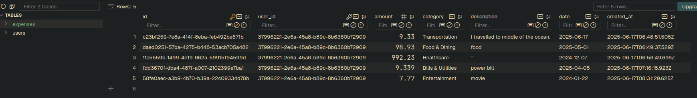

# Expense Tracker

A full-stack expense tracking application built with React and Node.js.

## demo


## db



## 🚀 Features

- **User Authentication** - Register/Login with JWT tokens
- **Expense Management** - Add, edit, delete expenses
- **Analytics Dashboard** - Visual charts and spending insights
- **CSV Export** - Export expenses to CSV format
- **Responsive Design** - Works on desktop and mobile

## 🛠️ Tech Stack

### Frontend (Client)
- **React 18** with TypeScript
- **Vite** - Fast build tool and dev server
- **Chakra UI** - Component library for styling
- **Recharts** - Charts and data visualization
- **Axios** - HTTP client for API calls
- **React Router** - Client-side routing

### Backend (Server)
- **Node.js** with Express.js
- **TypeScript** - Type-safe development
- **SQLite** - Lightweight database
- **JWT** - JSON Web Tokens for authentication
- **bcrypt** - Password hashing
- **Zod** - Input validation

## 📁 Project Structure

```
├── client/          # React frontend
│   ├── src/
│   │   ├── components/  # Reusable UI components
│   │   ├── pages/       # Page components
│   │   ├── contexts/    # React context providers
│   │   └── utils/       # API client and utilities
│   └── package.json
├── server/          # Node.js backend
│   ├── src/
│   │   └── server.ts    # Main server file
│   └── package.json
└── nixpacks.toml    # Railway deployment config
```

## 🔧 Development Setup

### Prerequisites
- Node.js 18+
- pnpm (recommended)

### Installation
```bash
# Install dependencies
pnpm install

# Install client dependencies
cd client && pnpm install

# Install server dependencies
cd ../server && pnpm install
```

### Running the App
```bash
# Start server (localhost:3001)
cd server && pnpm run dev

# Start client (localhost:5173)
cd client && pnpm run dev
```

## 🎯 How It Works

### Client Side
1. **Authentication Flow**: Login/Register forms with form validation
2. **Protected Routes**: Routes require authentication, redirect to login if not authenticated
3. **State Management**: React Context for user authentication state
4. **API Integration**: Axios client with automatic token attachment and error handling
5. **UI Components**: Reusable components built with Chakra UI
6. **Data Visualization**: Charts showing spending patterns and analytics

### Server Side
1. **RESTful API**: Express.js routes for all CRUD operations
2. **Database**: SQLite with two tables (users, expenses)
3. **Authentication**: JWT tokens with bcrypt password hashing
4. **Authorization**: Middleware ensures users can only access their own data
5. **Validation**: Zod schemas validate all input data
6. **Error Handling**: Centralized error handling with proper HTTP status codes

### Database Schema
```sql
-- Users table
users (id, email, password, created_at)

-- Expenses table  
expenses (id, user_id, amount, category, description, date, created_at)
```

### API Endpoints
```
POST /register     # User registration
POST /login        # User authentication
GET  /expenses     # Get user's expenses
POST /expenses     # Create new expense
PUT  /expenses/:id # Update expense
DELETE /expenses/:id # Delete expense
GET  /expenses/analytics # Get spending analytics
```

## 🚀 Deployment

### Railway (Recommended)
1. Push code to GitHub
2. Connect repository to Railway
3. Set environment variables:
   - `NODE_ENV=production`
   - `JWT_SECRET=your-secret-key`
4. Deploy automatically with nixpacks.toml

### Environment Variables
```bash
# Server
PORT=3001
JWT_SECRET=your-jwt-secret
SALT_ROUNDS=12
DB_PATH=./expenses.db
NODE_ENV=development
```

## 🔒 Security Features

- **Password Hashing**: bcrypt with configurable salt rounds
- **JWT Authentication**: Stateless token-based auth
- **Input Validation**: Server-side validation with Zod
- **SQL Injection Prevention**: Parameterized queries
- **User Isolation**: Users can only access their own data
- **CORS Protection**: Cross-origin request handling

## 📊 Key Features Explained

### Analytics Dashboard
- **Total Spending**: Sum of all expenses
- **Category Breakdown**: Pie chart showing spending by category
- **Monthly Trends**: Bar chart of spending over time
- **Recent Expenses**: List of latest transactions

### CSV Export
- Downloads expenses as CSV file
- Includes all expense data with proper formatting
- Filename includes current date

## 🔧 Architecture Decisions

- **Monolithic**: Single server handles both API and static files
- **SQLite**: File-based database for simplicity
- **JWT**: Stateless authentication for scalability  
- **TypeScript**: Type safety across frontend and backend
- **Single File Server**: Simple structure for rapid development

## 📝 License

MIT License - feel free to use this project as a template or learning resource.